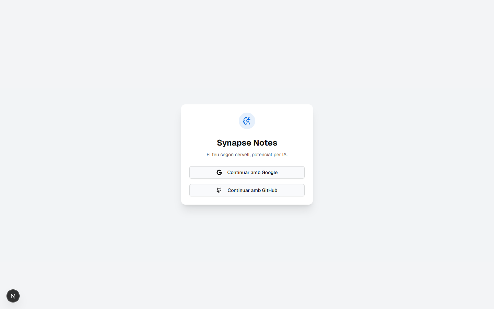
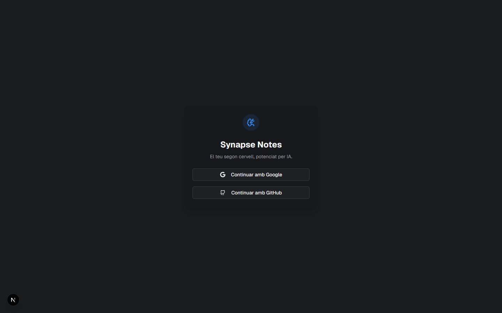
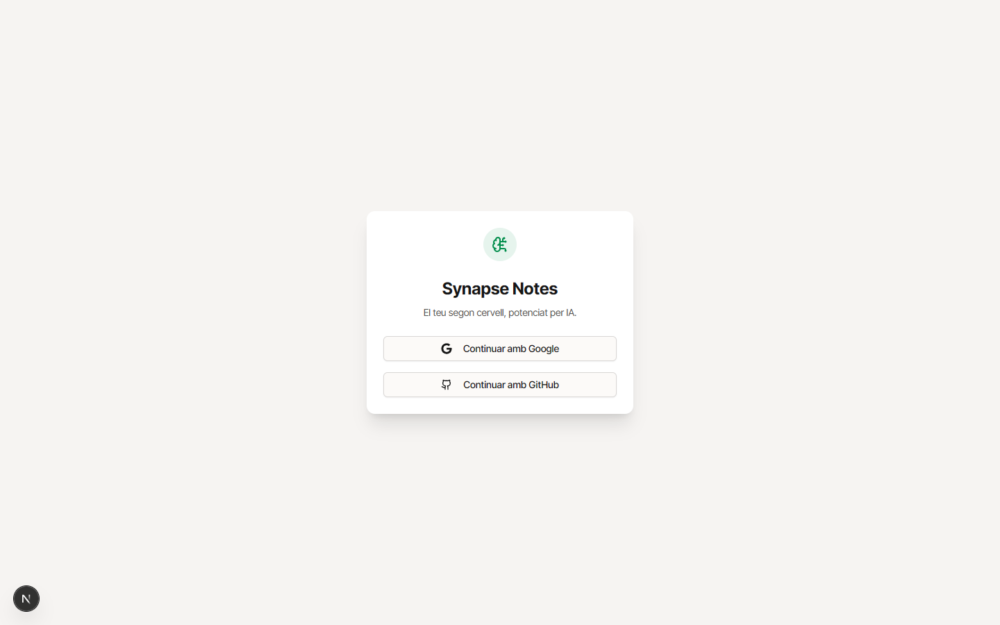
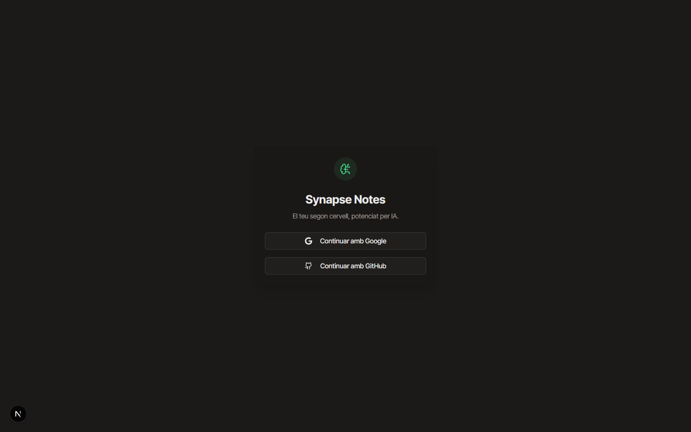
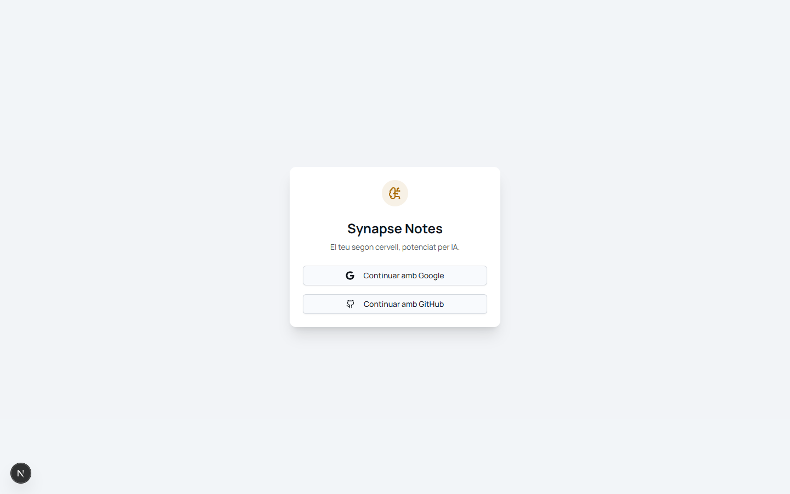
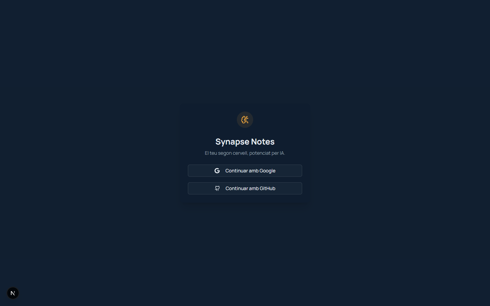

# Mockups — comparativa de 3 direccions alternatives

Mockups de `/login` generats el 2026-04-23 via `npm run dev` + Playwright
per a triar una direcció distinta a la Midnight Cartography original.

El Sergi va trobar que **Midnight Cartography** (UI-2 actual, commit
`e1fdac1`) se li veu "massa verdós" en dark (hue `200` = teal/cyan
percebut com a verd) i "antic" en light (paper càlid + gold + serif
Young Serif → vibe de llibre vell).

Aquests 3 mockups mantenen els anti-patterns acordats (no purple, no
generic shadcn, no aurora) però amb personalitats radicalment
diferents entre si.

> **Nota:** el cercle negre amb "N" al cantó inferior esquerre és el
> Next.js dev toolbar de `npm run dev` — no surt en production.

## Comparativa (4 opcions)

| | Light | Dark | Fonts | Vibe |
|---|---|---|---|---|
| **MC** (`../after-ui2/`) | paper càlid + gold | deep blue-green + gold | Young Serif · Literata · Inter Tight · JetBrains Mono | biblioteca / editorial / antique |
| **A — Graphite + Electric** | zinc-50 fred + electric blue | charcoal neutral + electric blue | Geist Sans · Geist Mono | Vercel / Linear / tech pur |
| **B — Zinc + Emerald** | cream neutral + emerald green | warm near-black + emerald | Inter Tight · JetBrains Mono | Notion / Linear productivity modern |
| **C — Navy + Amber** | frost white + amber calent | deep navy pur + amber calent | Manrope · JetBrains Mono | Stripe / fintech premium |

## Els 3 mockups en detall

### A — Graphite + Electric

- **Fons dark:** charcoal pur (`oklch(0.17 0.005 250)`) — **zero tint
  verdós**, és el fosc que el Sergi esperava
- **Accent primari:** electric blue `oklch(0.55/0.66 0.2 258)` — vibrant
  sense caure al purple AI
- **Secundari:** lime green per dades/èxit
- **Fonts:** Geist Sans + Geist Mono (open-source, de Vercel,
  distintives, **zero serif**)
- **Reclutador Vercel/Linear llegirà:** "aquesta persona sap construir
  UI modernes tech-first"

### B — Zinc + Emerald

- **Fons dark:** warm black neutral (`oklch(0.17 0.004 60)`) — tint
  càlid sense groguejar
- **Accent primari:** emerald `oklch(0.56/0.72 0.15 155)` — verd
  brillant modern, gens antique
- **Secundari:** amber soft per CTAs puntuals
- **Fonts:** Inter Tight + JetBrains Mono (sans-first, sense serif)
- **Vibe:** Notion modern, productivity madura

### C — Navy + Amber

- **Fons dark:** deep navy `oklch(0.19 0.04 255)` — blau profund **sense
  res de verd**
- **Accent primari:** amber càlid `oklch(0.58/0.76 0.13-0.14 70-72)` —
  contrast calent sobre blau fred
- **Secundari:** slate steel neutre
- **Fonts:** Manrope + JetBrains Mono (sans geomètric, distintiu del
  "Inter default")
- **Vibe:** Stripe dashboard, GitHub Premium, fintech

## La meva lectura honesta

- **Si el TFG/portfolio és la prioritat:** A (Graphite + Electric). És
  el look que senyala "modern dev / tech-first" immediatament, usa
  Geist (la font signature de Vercel) i mostra que domines Next.js
  idiomàticament.
- **Si vols algo més càlid sense ser editorial:** B (Zinc + Emerald).
  L'emerald modern és **l'anti-thesis del gold antique** — es veu jove
  sense ser cridaner.
- **Si vols la imatge "SaaS professional serios":** C (Navy + Amber).
  El navy+amber és clàssic de financial/enterprise software.

**La meva aposta de debò:** **A**. Motius concrets: (1) evita totalment
el "massa verdós" que et molestava; (2) Geist té personalitat sense ser
editorial; (3) un reclutador tech reconeix Vercel/Linear aesthetic en
un segon i t'assigna credibilitat tècnica.

## Decisió

Diga'm **A**, **B**, **C**, o alguna variació (p.ex. "A però amb accent
emerald en lloc de blue"). Quan confirmis, aplico la paleta + fonts via
`git revert e1fdac1` + commit net UI-2 amb la direcció triada.

Si cap et convenç, també pots:

- Passar-me un link de 21st.dev amb un component que t'agradi i
  replico l'estil
- Demanar una 4a variant (p.ex. "A però més càlid", "B però amb
  accent taronja" etc.)
